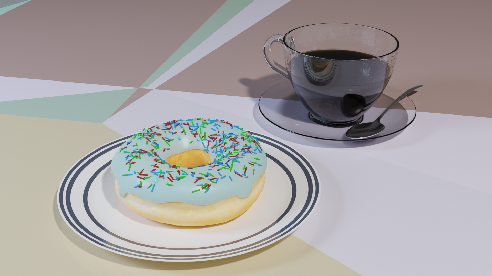

# Jonathon Racz

_A slightly disorganized collection of my work._

# Portfolio (Code)

## [HarmonAIze](https://github.com/jonathonracz/harmonaize)

An accessibility-focused multi-track MIDI sequencer designed for playing piano with one hand. Accompaniment for melodies are automatically generated.

I was responsible for the UI, Audio/MIDI playback engine, Python/C++ interop, and hardware I/O.

- _Time: 3 months_
- _Languages: C++, Python_
- _Libraries: [JUCE](https://github.com/juce-framework/JUCE), [SFZero](https://github.com/jonathonracz/SFZeroModule), [readerwriterqueue](https://github.com/cameron314/readerwriterqueue), [juce_toys](https://github.com/jcredland/juce-toys), [mido](https://github.com/olemb/mido), [mma](https://github.com/infojunkie/mma), [pybind11](https://github.com/pybind/pybind11)_

## [GoatMix](https://github.com/jonathonracz/GoatMix)

A VST/AU Mac/Windows/iOS compatible all-in-one audio mixing plugin. Created as part of an undergraduate capstone project.

- _Time: 3 months_
- _Languages: C++_
- _Libraries: [JUCE](https://github.com/juce-framework/JUCE), [juce_toys](https://github.com/jcredland/juce-toys), [readerwriterqueue](https://github.com/cameron314/readerwriterqueue)_

## [jtracer](https://github.com/jonathonracz/jtracer)

A C++ path tracer capable of running on the CPU or as an Apple Metal compute kernel.

- _Time: 2 months_
- _Languages: C++, Objective-C, Metal Shading Language_
- _Libraries: Cocoa, Metal_

## [OpenSimplexCPP](https://github.com/jonathonracz/OpenSimplexCPP)

A header-only, dependency-free, GPU compute ready implementation of OpenSimplex Noise derived from Stephen M. Cameron's C port of Kurt Spencer's Java implementation.

- _Time: 2 weeks_
- _Languages: C, C++, Objective-C, Metal Shading Language_
- _Libraries: Cocoa, Metal_

## [AudioFilePlayerPlugin](https://github.com/jonathonracz/AudioFilePlayerPlugin)

A Mac/Windows/Linux VST/AU audio plugin for playing audio in test environments. Used in audio programming lessons by [The Audio Progammer](https://youtu.be/YwSonmLAAzI?t=390). Ported from the JUCE audio playback sample to an audio plugin environment.

- _Time: 2 days_
- _Languages: C++_
- _Libraries: [JUCE](https://juce.com/)

## [MIDISender](https://github.com/jonathonracz/MIDISender)

A cross-platform utility for sending arbitrary MIDI messages. Used for debugging/reverse engineering MIDI control surfaces.

- _Time: 1 day_
- _Languages: C++_
- _Libraries: [JUCE](https://github.com/juce-framework/JUCE)

## [cos-tools](https://github.com/jonathonracz/cos-tools)

A reverse-engineered asset archive unpacker for the 2002 PlayStation 2 game Harry Potter and the Chanber of Secrets.

- _Time: 1 week_
- _Languages: C_

## [jdr_glm_juce](https://github.com/jonathonracz/jdr_glm_juce)

A JUCE module wrapper for the GLM linear algebra library.

- _Time: 1 day_
- _Languages: C++_

## [circular_buffer_stl](https://github.com/jonathonracz/circular_buffer_stl)

Boost's circular_buffer module converted to use all C++11 STL primitives, making it free of Boost dependencies.

- _Time: 1 day_
- _Languages: C++_

# Portfolio (3D)

## GoldenEye: Source

<iframe frameborder="0" height="315" src="https://www.youtube.com/embed/9dXj1w9cmtM" width="560"></iframe>

I spent 6 years as a lead developer for the fan GoldenEye 007 recreation project GoldenEye: Source under the pseduonym _jonathonssl_. During this time, I did mostly technical art, moving assets through the Souce engine's obtuse asset pipeline. I rigged the female scientist character (complete with a physics-enabled ponytail), produced many particle effects, and made the entire 3rd person character animation set. I spent several years working on and off on a remake of the _Basement_ level, in the embedded video above.

_Tools: Source SDK, SoftImage XSI, Adobe Photoshop, Adobe After Effects_

## Anvil

An anvil made while getting back into 3D art after a long absence.

_Tools: Blender_

## Doughnut and Coffee

A scene of a doughnut and coffee made while getting back into 3D art after a long absence.

_Tools: Blender_
